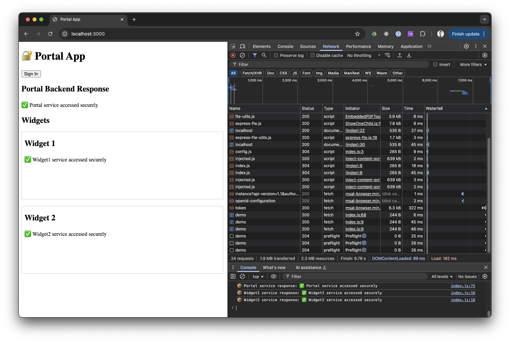

# 🔐 Entra SPA Widgets POC

This project demonstrates a secure architecture for integrating multiple widget apps (micro frontends) into a central single-page portal app using Azure Entra ID (Microsoft identity platform). Each component is isolated and protected by its own app registration and access token.



---

## 📆 Project Structure

```
.
├── portal/
│   ├── app/         # SPA with MSAL.js login and widget iframes
│   └── service/     # Express backend protected by Entra access token
├── widget1/
│   ├── app/         # Static frontend served via iframe
│   └── service/     # Token-protected API for Widget1
├── widget2/
│   ├── app/         # Static frontend served via iframe
│   └── service/     # Token-protected API for Widget2
├── scripts/
│   └── setup-azure-apps.sh   # Automates Entra app registrations and config
├── pnpm-workspace.yaml
└── package.json
```

---

## ⚙️ Prerequisites

* Node.js + PNPM
* Azure CLI with access to create AAD app registrations
* [`jq`](https://stedolan.github.io/jq/) and `uuidgen` installed
* Developer tenant or test Entra environment

---

## 🚀 Setup

1. **Provision Azure Entra app registrations**:

```bash
az login
./scripts/setup-azure-apps.sh
```

This will:

* Register 3 apps: Portal, Widget1, Widget2
* Assign scopes and pre-authorized apps
* Set `accessTokenAcceptedVersion = 2`
* Write `config.js` into each frontend/backend folder

2. **Install dependencies and start all apps**:

```bash
pnpm install
pnpm dev
```

This will run:

* Portal on `http://localhost:3000`
* Widget1 on `http://localhost:3001`
* Widget2 on `http://localhost:3002`
* Each backend on ports `3100`, `3101`, and `3102` respectively

---

## 🧪 How It Works

* The **portal SPA** logs in the user using `msal-browser` (popup)
* It obtains access tokens for:

  * Its own API
  * Widget1 and Widget2 APIs
* It sends tokens to the widgets using `postMessage`
* Each widget uses the received token to call its own backend
* All backends validate the token using `jwks-rsa` and Entra public keys

---

## 🔒 Security Notes

* All access tokens are v2.0 and scoped to the specific app
* Each API checks the `aud` (audience) and `iss` (issuer) claim
* Each API also checks the `scp` claim matches the expected scope (e.g. `access_as_user`)
* CORS is configured to allow only frontend origin access
* No secrets are used; only public SPA flows

---

## 🚜 Cleanup

To remove all created Entra apps, manually delete them via Azure Portal. All created Entra apps are prefixed with "Pre-Auth-App-Test".

---

## 📎 Related

* [MSAL.js Docs](https://github.com/AzureAD/microsoft-authentication-library-for-js)
* [Microsoft Identity Platform Overview](https://learn.microsoft.com/en-us/azure/active-directory/develop/)
* [Entra ID App Manifest Reference](https://learn.microsoft.com/en-us/azure/active-directory/develop/reference-app-manifest)
